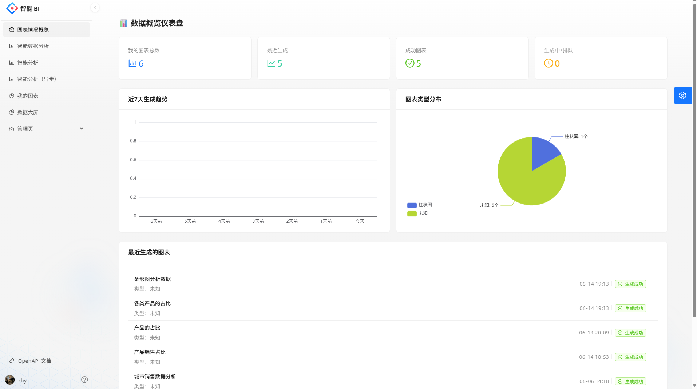
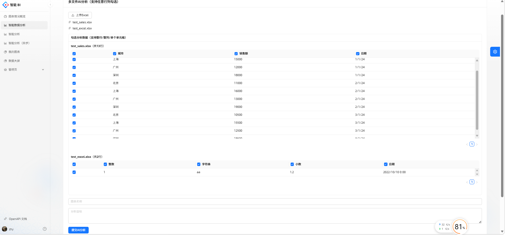
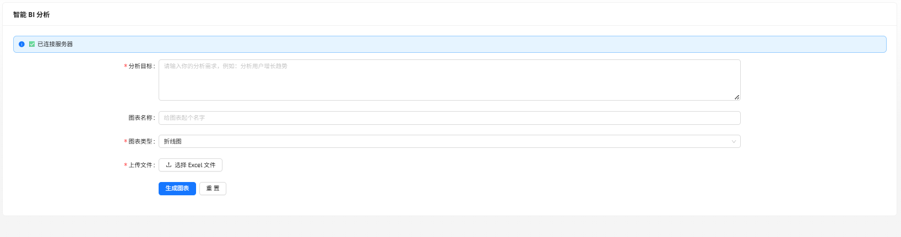
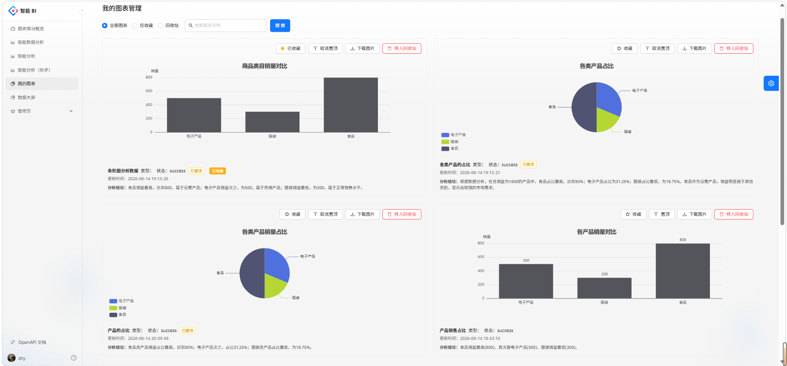
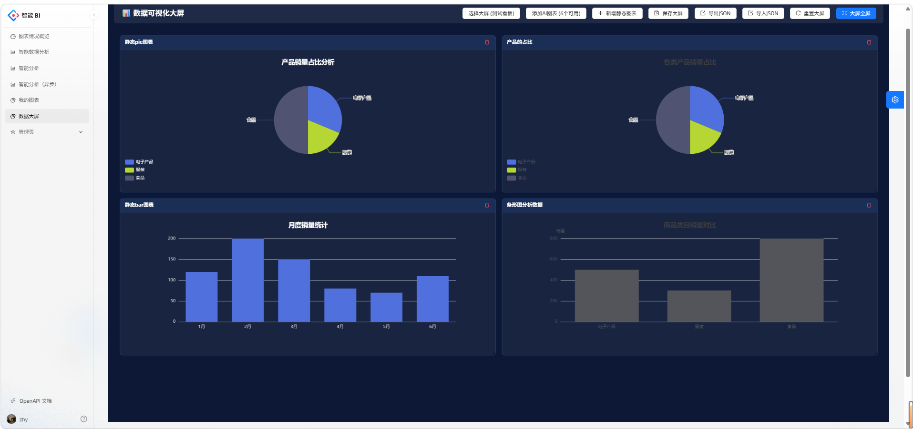

# 智能 AI 可视化 BI 平台

## 项目介绍
是一套**前后端分离**的轻量级智能 BI 系统。
后端基于 Spring Boot 提供 AI 数据分析、图表管理、数据大屏接口；
前端基于 Ant Design Pro + React + TypeScript 构建企业级后台管理页面。
用户上传 Excel 数据文件后，系统自动调用 AI 模型生成可视化图表配置与数据分析结论；
系统同时支持多文件联合分析、自定义数据大屏、图表收藏/回收站管理、任务 WebSocket 实时状态推送等完整 BI 业务能力。

## 技术栈
### 后端
- Spring Boot
- MyBatis-Plus
- RabbitMQ：异步解耦 AI 生成任务
- Redis：接口限流、分布式锁、缓存
- WebSocket：实时推送图表生成状态
- Hutool、Gson、Apache Commons Lang3
- 自定义 AiManage：对接大语言模型
- 自定义 `@AuthCheck` 注解实现简易权限控制

### 前端（React + TS）
- 框架：Umi Max / Ant Design Pro v6
- UI 组件：Ant Design v5、@ant-design/pro-components
- 图表可视化：ECharts + echarts-for-react
- 大屏布局拖拽：react-grid-layout、react-resizable
- 语言：TypeScript
- 包管理：npm / pnpm
- Node 要求：>= 20.0.0

### 数据库
MySQL 存储用户、图表、数据看板、任务配置等业务数据

## 项目模块（Controller）
1. **UserController `/user`**
   用户账号体系，包含注册、登录、注销、个人信息修改；管理员可管理全部用户。
2. **ChartController `/chart`**
   图表核心管理模块，提供图表增删改查、收藏、置顶、回收站、数据统计仪表盘；
   内置三种 AI 图表生成模式：同步、线程池异步、RabbitMQ 消息队列异步。
3. **BoardController `/board`**
   数据大屏模块，支持创建、保存、查询、删除可视化大屏，绑定已有图表自定义布局。
4. **SmartAnalysisController `/smart`**
   高级多文件联合分析，支持多 Excel 上传预览，通过 Session 临时缓存文件，多表数据拼接后异步生成图表。

## 核心业务流程
### 1. MQ 异步生成图表（推荐生产使用）
1. 校验登录、文件格式/大小、当日生成次数、接口限流
2. Excel 文件解析为 CSV 文本，组装 AI 提示词
3. 数据库写入 Chart 记录，状态置为 `wait`
4. 发送任务消息到 RabbitMQ，WebSocket 向前端推送等待状态
5. MQ 消费者消费任务，调用 AI 获取图表 JSON 配置与分析文字
6. 更新图表状态为 `success` / `failed`，实时推送结果给前端

### 2. 多文件智能分析
1. 上传多个 Excel，Redis 分布式锁防止高频重复提交
2. 文件字节数组存入 Session，返回表格预览数据
3. 用户选择需要参与分析的表格字段，提交分析任务
4. 读取 Session 文件，根据选择配置拼接完整分析数据
5. 数据长度截断后入库，发送 MQ 异步处理，清理 Session 文件缓存

## 功能亮点
- 三种 AI 任务执行方案：同步阻塞 / 线程池异步 / MQ 消息队列异步
- 完整图表生命周期管理：新增、编辑、收藏、置顶、回收站恢复/物理删除、重新生成
- WebSocket 实时推送 AI 任务运行状态
- Redis 实现接口限流、分布式锁防重复操作
- 内置数据仪表盘：图表总量、成功任务、运行中任务、7天趋势、图表类型分布
- 多 Excel 文件联合分析，无需重复上传文件
- 数据可视化大屏，自定义图表布局

## 环境依赖
- JDK 8 及以上
- MySQL 5.7 / 8.x
- Redis
- RabbitMQ
- 可访问的大模型接口（AiManage 配置）,接入智谱ai

## 后端启动步骤
1. 执行项目 SQL 文件，初始化数据库表结构,打开create_table.sql
2. 修改 `application.yml` 配置数据库、Redis、RabbitMQ、AI 模型相关配置
3. 启动 Spring Boot 服务
4. 前端调用用户接口完成注册登录，即可使用图表分析、大屏功能

## 前端启动步骤
1. npm install
2. npm run dev

